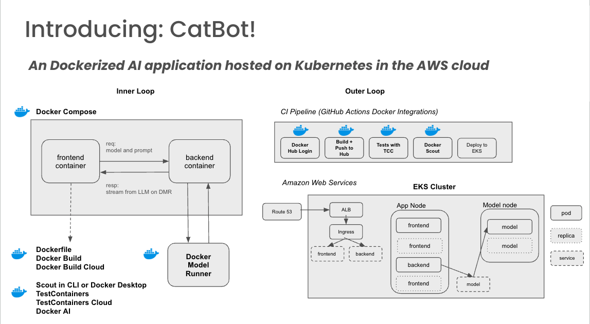

## Accelerating Development with Docker

This demonstration will walk through this project to showcase Docker's build, test, and security features.

## Getting familiarized with AI
### Topics: Ask Gordon, Dockerfiles 🐳
- Open Docker Desktop
- Select the stars on the top left to "Ask Gordon"
- Select Explain my Dockerfile -> Give access to CatBot directory
- See the various descriptions of lines in the Dockerfile

Knowing this, let's start developing.

## Running in my dev environment
### Containers, TestContainers, TCC 🐳
- Navigate back to project on VS Code
- Start model container as instructed in README
- Run app locally using: `dotenv -e .env.dev -- npm run start:dev`
- Split view between VSCode and Chrome
- Navigate to localhost:3000 on Chrome
- *Note: We are only running the LLM container*
- Test it out!
- *What if I wanted to test this locally?*
- Split VS Code and Docker Desktop
- Navigate to tests/server.test.js and show TestContainers logic
- Run `npm test` and watch test run, containers appear in DD
- Switch to TestContainers cloud and re-run `npm test`, notice the containers do not appear in DD
- View results in [TCC dashboard](https://app.testcontainers.cloud/accounts/9926/dashboard)

## Let's build and scan our image!
### Topics: Build, Build Cloud, and Scout 🐳
- Let's try to build this locally: `docker build -t samanthamorris684/catbot:nobc . --platform="linux/amd64"`
- *Note: This will only leverage local caching!*
- We can also use build cloud remote bulder: `docker buildx build --builder cloud-demonstrationorg-default -t samanthamorris684/catbot:bc . --platform ="linux/amd64"`
- Subsequent builds of this image will use the shared build cache on different machines, making builds faster! [Take a look.](https://app.docker.com/build/accounts/demonstrationorg/builds)
- *Note: We will also make use of build cloud in the CI pipeline.*
- Navigate to Docker Desktop and search for image build
- Run analysis for vulnerabilities with Docker Scout

## How can we start up and tear down all these services together, and use containers for all?

### Topics: Docker Compose 🐳

- Navigate to the compose.yaml file
- Two different containers/services, port mapping to access entry of app on port 3000
- *Note: These containers will be able to talk to each other via their exposed ports*
- Run `docker compose up --build`
- Navigate to localhost:3000
- When done, run `docker compose down`

## Bonus: How can we automate this?

- You can use a pipeline to automate this process, in this case we use GitHub Actions
- Let's make a quick PR.
- Edit line 213 of App.js to a different cat name
- Quick preview of a frontend change by running `dotenv -e .env.dev -- npm run start:dev`
- `git branch -b new-cat`
- `git add src/App.js` && `git commit -m "Change cat name"`
- `git push`

- Navigate to GitHub and open a PR then see the pipeline for building, testing, and scanning

- *Note: On merge, we kick off the deployment to prod, but we won't show that here!*

- Navigate back to diagram slide to close out.